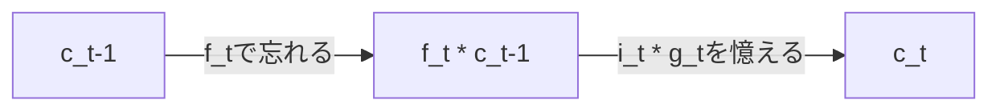

# LSTM - RNNに記憶を持たせる試みその2

Long Short Term Memory: 短期記憶と長期記憶を併せ持ったもの。
＝＞RNNの記憶力保たない問題を解決！

## Simple RNNの課題

### RNNとは

$$
Input:x^{(0)}, x^{(1)}, \cdots, x^{(T)} , h^{(-1)}\\
y^{(t)}, h^{(t)} = f(x^{(t)}, y^{(t-1)}, h^{(t-1)})\\
Output: y^{(0)}, y^{(1)}, \cdots, y^{(T)}, h^{(T)}
$$

### 記憶力が保たない問題

Simple RNN (in Keras)の場合、

$$
y^{(t)} = h^{(t)} = \tanh(x^{(t)} \times W_xh + h^{(t-1)} \times W_hh + b_h) \\
= f^{\tanh}(x_t, h_{t-1})
$$

(二段目の表記方法の意味合い：活性化関数がtanhで全結合
長い文章の要約などでは致命的。
これを解決する為に作られたのがLSTM。

## LSTMの場合

$$
f_t = f_f^{\sigma}(x_t, h_{t-1}) \\
i_t = f_i^{\sigma}(x_t, h_{t-1}) \\
o_t = f_o^{\sigma}(x_t, h_{t-1}) \\
g_t = f_o^{\tanh}(x_t, h_{t-1}) \\
c_t = f_t \circ c_{t-1} + i_t \circ g_t \\
y_t = h_t = o_t \circ \tanh(c_t)
$$

この6個の数式。これが長期記憶と短期記憶を司る、LSTMの全て。
まさに長期記憶と短期記憶が融合してる～！感動的な式！
($\circ$はアダマール積。成分同士をかけるやつ。)

6つの文字の定義と意味をちゃんと把握する事が大事！
一番大事なのがcとh。
c:長期記憶担当
h:短期記憶担当

## まずは長期記憶の数式から！

$$
c_t = f_t \circ c_{t-1} + i_t \circ g_t \\
$$

右辺の意味を1個ずつさらっていく。
2つの項の和になってるので、まず右辺第一項$ f*t \circ c*{t-1}$から見ていく。

### 右辺第一項

$c\_{t-1}$は、1個前の長期記憶。それに対して、ｆが掛かってる。
fの事を「Forget gate vector」という。忘れる事を司ってる。

$$
f_t = f_f^{\sigma}(x_t, h_{t-1})
$$

活性化関数がシグモイド＝＞ｆは0~1の間を取る。
従って、0~1の値をとるものが、1個前の長期記憶に掛かってる。
どういう意味か迷ったら、極端な例を考える。
f_tがほとんどゼロだったら、c_t-1がc_tにほとんど影響を与えなくなる。
これは「前の記憶を完全に忘れ去る」事を意味している！

逆にf_tがほとんど1だったら、C_t-1がほぼそのままc_tに引き継がれる。
これは「前の記憶を受け継ぐ。受け流す」事を意味している。

fは、「**前までの長期記憶の中で、いらんやつを消して必要なやつは残す**」役割をはたしている。

### 右辺第二項

上述した第一項を踏まえて第二項を見ると、前までの長期記憶の中からいらない部分を消して、第二項を加えて、次の長期記憶にしている。
つまり第二項$i_t \circ g_t$は、新しい入力を読んだことによって長期記憶に加えたい「新たな記憶」である。

まずは、$g_t$。

$$
g_t = f_o^{\tanh}(x_t, h_{t-1})
$$

新しい入力x_t(ex. 単語)と、前までの短期記憶h_t-1を組み合わせてできてる。
つまりgは、「新しい入力x_t(ex. 単語)と前までの短期記憶h_t-1から、どんな情報を長期記憶cに加えるべきかを制御する」働きをしている。

では$i_t$は？

$$
i_t = f_i^{\sigma}(x_t, h_{t-1})
$$

これもまた０～１の値をとる。
fと同様に考えてみる。
i_tが0に近いと、新しい入力を長期記憶にほとんど加えない。
1に近いと、「文脈的にも話の切り替わりだから、新しい入力をバンバン入れていきましょう！」みたいな感じ。

つまり、gの方で「どんな情報を長期記憶に加えるべきか=**加える記憶**」、iの方で「それ(g_t)をどれくらい加えるべきか=**加える度合い**」を制御している。
iの事を「**Input Gate Vector**」という。

そして、長期記憶を司るcの事を「**Context Vector(文脈ベクトル)**」という。

## 残るは短期記憶の数式！

$$
y_t = h_t = o_t \circ \tanh(c_t)
$$

oはまた０～１。
よって、短期記憶h_tは、「長期記憶c_tの中から必要なものだけを抜き出したモノ」
例えばc_tが10次元ベクトルだったとして、上の5個の次元は短期記憶に使って、下の5個の次元は長期記憶に使いたい場合、10次元ベクトルo_tは上の5個の次元は１に近くて、下の5個は0に近くなる...!そんな感じのベクトル！

なんでこんなことやってるの？「文章を読む」作業をイメージ。

- 長期記憶＝文脈やあらすじを捉えたい部分 ex. ボブが火事場から逃げてきて...
- 短期記憶＝次の単語(＝入力)をどう処理するか。 ex. This is aって来てるから次は名詞？？

つまり、「文章全体を読む時に保持したい記憶」と「単語を処理する為に残しておきたい、前後5単語くらいの情報」は必要な内容が異なる。
従って、長期記憶の中から短期記憶で使い部分を抜き出す事をoで実現してる。
oは「**Output Gate Vector**」と呼ぶ。

## LSTMの数式の意味

上述した通り、f, i, oは数式も役割も似ている。
**「どれくらい情報を次に伝えて、どれくらい切り落とすのか」という、情報を渡す度合いを制御している**。一般にこのような働きをするものを「**Gate**」と呼ぶ。
例えば、f=0はゲートが閉じている状態を意味する。

gは、単語を読んで(=新しい入力を受け取って)「こういう意味だと思うよ～」という「(長期)記憶に加えたい内容」を決めている。

そしてLSTMの神髄は最後の2式。
cは、長期記憶をどうやって受け継ぐかという数式。
加えて、長期の中から短期を抜き出すのが6式目。

## 長期/短期記憶を味わう。

c_tは、つぎたしつぎたしのウナギのたれみたいな。
h_tは、使い捨て。全然受け継がれていかない。数式を見ると、**h_t-1は全て、括弧の中でしか使われない**！**直接的な繋がりがない**！これがc_tとh_tの大きな違い！

長期記憶cの数式$c_t = f_t \circ c_{t-1} + i_t \circ g_t$を二段階で考えてみる。

## まとめ

LSTMは、

- 長期記憶と短期記憶の合わせ技！
- ↑これの忘却と追加を、3種類のgateを使って制御する！

最後にLSTMの"あの図"は以下。(c_t-1から考えると良いかも！)

## 参考

- https://www.youtube.com/watch?v=oxygME2UBFc
- https://medium.data4sci.com/causal-inference-part-xi-backdoor-criterion-e29627a1da0e

