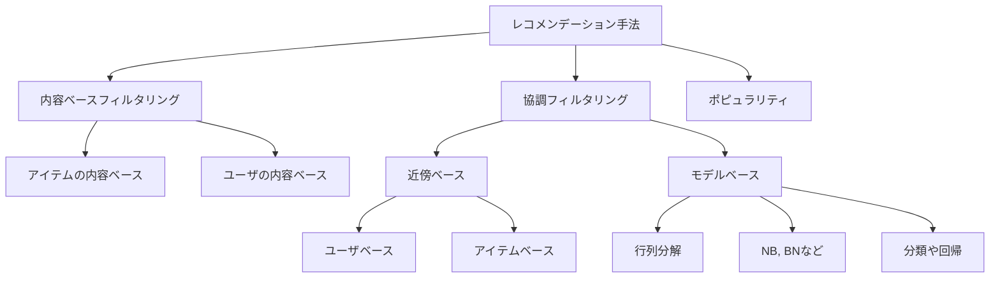

<!-- タイトル：kaggle Competitionの為にImplicit ALS base modelの概要を学ぶ１ -->

# はじめに

1 年前に Kaggle に登録しましたが、今回初 Competition として、「H&M Personalized Fashion Recommendations」に参加してみようと思いました(1 ヶ月おくれですが笑)。
データセットはテーブルデータを基本としているようで、画像データやテキストデータに疎い私の様な人にも比較的取っつきやすい気がします。
また、**最終的な成果物(提出物)が"顧客へのレコメンド"**という点がよりビジネス的というか、実務(?)に近いような気がする(一学生の偏見かもしれません笑)ので、個人的に楽しみです：）

今回は、レコメンドエンジンにおける一手法の「協調フィルタリング」、の一手法である行列分解(Matrix Factorization)について自分なりにまとめます。また、行列分解のアルゴリズムの 1 つである ALS(Alternate Least Squares)についても理論をまとめ、スクラッチ実装してみます。

ざっくり調べただけなので恐らく正確ではありませんが、レコメンド手法の樹形図みたいなものを作成してみました。
行列分解(Matrix Factorization)は右下にありますね。

# 行列分解(Matrix Factorization, MF)って何ぞや？

行列分解とは、アイテムに対するユーザーの評価値を行列にした**評価値行列**を、各ユーザーのベクトルからなる**ユーザー行列**と、各アイテムのベクトルからなる**アイテム行列**の**積に分解すること**を意味します。
(本文では)
行列分解がやっている事を数式にすると以下です。

$$
X \approx W^T \cdot H = \hat{X}
$$

$$
X, \hat{X} \in R^{m\times n}, W \in R^{k\times m}, H\in R^{k \times m}
$$

ここで、

- m はユニークなユーザの数。n はユニークなアイテムの数。
- X は行がユーザ、列がアイテムである評価行列(Rating Matrix)。
  - 行インデックス i と列インデックス j がそれぞれ一人のユーザ、1 個のアイテムと対応。
  - 行列の$i, j$成分の値$x_{i, j}$は、ユーザ i がアイテム j に対して下した評価(explixit データの場合)
- W は行がユーザ、列が潜在変数であるユーザ行列。
- H は行がアイテム、列が潜在変数であるアイテム行列。
- k は、指定された潜在変数の数。

行列分解では、潜在変数の個数(=グルーピングの数)k を与えた時、評価行列 X を W と H の積に分解します。
正確には、X にできる限り近い(近似した)$\hat{X}=W^T\cdot H$を推定しています。

得られた$\hat{X}$によって、ユーザがまだ評価していないアイテムの評価値(Explicit データの場合)を予測したり、ユーザの好みを定量化する事ができます。
元々の評価行列$X$ではゼロ(=未評価)だった要素が、推定された$\hat{X}$では補完されているイメージですかね！(Explicit データの場合！)

また、評価行列の推定値$\hat{X}$の各要素(=**ユーザ u によって得られるアイテム u の評価**)は以下の様に、$W_u$(＝行ベクトル)と$H_i^T$(＝列ベクトル)の内積として表せますね。

$$
\hat{x}_{u, i} = \mathbf{w}_u^T \cdot \mathbf{h}_i \\
= \sum_{f=0}^{k}{w_{u, f} h_{f, i}}
$$

ここで、

- $\mathbf{w}_u^T, \mathbf{h}_i \in R^{k\times 1}$(長さ k の列ベクトル)。
- $w_{u, f}, h_{i, f}$:それぞれ $\mathbf{w}_u$及び$\mathbf{h}_i$の f 番目の要素。

## 行列分解における目的関数

さて、行列分解を実施する、言い換えれば、$X \approx W^T \cdot H = \hat{X}$を満たす$W$と$H$を推定する為の目的関数を上の式から考えると、「**真の評価行列と推定された評価行列の誤差を最小限に抑えること**」って思ってしまいます。この場合にパッと思いつく、最小化したい目的関数(誤差関数)は、

$$
Loss = \argmin_{H, W}||X-\hat{X}|| \\
= \argmin_{H, W}||X-W^T\cdot H||
$$

ですね。もしくは絶対値は扱いづらいので、二乗して

$$
Loss = \argmin_{H, W}(X-\hat{X})^2 \\
= \argmin_{H, W}(X-W^T\cdot H)^2
$$

でしょうか。しかし実際にこれらの目的関数で最小化してしまうと、評価行列$X$のゼロ要素(=)もゼロに近い値で推定されてしまいます。
あれ、元々の評価行列$X$ではゼロ(=未評価)だった要素が、$\hat{X}$でもゼロに近い値だったら、そのユーザの好みを予測できませんね...。

つまりレコメンデーションタスクでの行列分解における目的は、「評価行列$X$を正確に近似できるような、$W^T \cdot H = \hat{X}$を推定する」事ではなく、「**評価行列$X$におけるゼロ要素(=未評価、穴あきの箇所)を補完(予測)できるような**、$W^T \cdot H = \hat{X}$を推定する」ことなんですよね！

なので、レコメンデーションでの行列分解(Matrix Factorization)における目的関数は以下の様になります。

$$
Loss = \sum_{(u,i) \in I} (x_{ui} - \mathbf{w}_u^T \mathbf{h}_i)^2
$$

ここで$I$は評価行列における非ゼロ要素の index の集合です。
つまり、評価行列$X$の非ゼロ要素のみを対象に、$\hat{X}$との誤差を最小化していく、という事ですね！
そうすれば、評価行列$X$におけるゼロ要素は、$\hat{X}$ではゼロに近い値にはなりません。これにより、評価行列では未知だった、「あるユーザの、未評価のあるアイテムに対する嗜好度合い」が予測できそうですね！

なお、実際の行列分解アルゴリズム(ex.ALS)では、上式の二乗和誤差に正則化項(ALS の場合は L2 正則化項)を加えたものを目的変数とします。

まとめると、「**W と H の各列ベクトル**」、言い換えれば「**各ユーザ、各アイテムに対する$\mathbf{w}_u$及び$\mathbf{h}_i$**」を**既知の評価値(疎行列 X の非ゼロ要素)から学習する**のが 行列分解(Matrix Factrozation)であるようです。

# ALS（交互最小二乗法、Alternating Least Square）アルゴリズムの理論:

行列分解(行列因数分解)アルゴリズムで、最も有名なものの 1 つが ALS（Alternating Least Squares, 交互最小二乗法）です。

ALS を用いた行列分解における目的関数は、以下の通りです。

$$
    Loss = \sum_{(u,i) \in I} (x_{ui} - \mathbf{w}_u^T \mathbf{h}_i)^2 + L2\\
    = \sum_{(u,i) \in I} (x_{ui} - \mathbf{w}_u^T \mathbf{h}_i)^2 + \lambda \Biggl(\sum_u n_{w_u}|\mathbf{w}_u|^2 + \sum_i n_{h_i}|\mathbf{h}_i|^2\Biggr)
$$

ALS では、L2 正則化項が追加されていますね。ここで、

- $I ：評価値が格納されているインデックスの集合。$
- $ x\_{u, i}：評価行列 X の u 行目 i 列目の要素。$
- $ \lambda：正則化項の強さを指定する値(ハイパラ?)$
- $ n\_{w_u}：I の u 行のランク(=ユーザ u が評価したアイテムの数)$
- $ n\_{h_i}：I の i 行のランク(=アイテム i を評価したユーザの数)$

また、ALS では**2 つの目的関数を交互に最小化**し、**2種のパラメータを交互に更新**します。

- 最初にユーザ行列を固定し、アイテム行列の値$H$を更新。
- 次にアイテム行列を固定し、ユーザ行列の値$W$を更新。

これを繰り返します。
目的関数を最小化するパラメータを探す為の更新式は以下の通りです。
  - $$ e_{u, i} = x_{u, i}-\mathbf{w_u}^T \mathbf{h_i} $$
  - $$ w'_{u, k}= w_{u, k} + 2 \times \alpha \cdot e_{u, i} \cdot h_{k, i}$$
  - $$ h'_{i, k}= h_{u, k} + 2 \times \alpha \cdot e_{u, i} \cdot w_{u, k}$$

学習率$\alpha$の勾配降下法かな？
$\alpha$以降は、目的関数を各パラメータで一回微分したら出てきそう...な気がしますね。また時間があれば導出してみようと思います：）

# 
# おわりに
今回の記事では、レコメンドエンジンにおける一手法の「協調フィルタリング」、の一手法である行列分解(Matrix Factorization)について、自分なりにまとめてみました。また、行列分解のアルゴリズムの 1 つである ALS(Alternate Least Squares)についても理論をまとめ、スクラッチ実装してみました。

実際に自分で数式を記述したりスクラッチ実装したりしてみると、理解しやすい気がします！やって良かったですね：）
今回、**Explicit データの評価行列に対する行列分解**の流れが何となく掴めた気がします。
次回は、**Implicitデータの評価行列に対する行列分解**について勉強しようと思います！H&M Personalized Fashion RecommendationsはImplicitデータですし！

# 参考

以下の記事を参考にさせていただきました！良記事有り難うございました！
- https://blog.brainpad.co.jp/entry/2017/02/03/153000
- https://tech.uzabase.com/entry/2021/09/28/163623#:~:text=%E8%A1%8C%E5%88%97%E5%88%86%E8%A7%A3%E3%81%AB%E3%82%88%E3%82%8B%E5%8D%94%E8%AA%BF%E3%83%95%E3%82%A3%E3%83%AB%E3%82%BF%E3%83%AA%E3%83%B3%E3%82%B0,%E3%81%AB%E5%88%86%E8%A7%A3%E3%81%99%E3%82%8B%E3%82%A2%E3%83%AB%E3%82%B4%E3%83%AA%E3%82%BA%E3%83%A0%E3%81%A7%E3%81%99%E3%80%82
- 