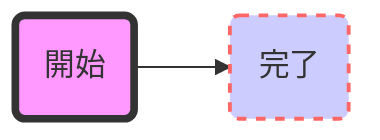

# mermaid.jsでノードの形を変更する
括弧を使い別ける事で、ノードの形を変更できるようですね。
```
graph TD
    ノード
    ノード1[テキスト入りノード]
    ノード2(丸括弧形ノード)
    ノード3((円形ノード))
    ノード4>非対称形ノード]
    ノード5{ひし形ノード}
```
こんな感じになるようです。

# mermaid.jsでノードの色を変更する
CSSの記法(?)が使えるようです。
```
graph LR
    start(開始)-->stop(完了)
    style start fill:#f9f,stroke:#333,stroke-width:4px
    style stop fill:#ccf,stroke:#f66,stroke-width:2px,stroke-dasharray: 5, 5
```
こんな感じになります。

# 
