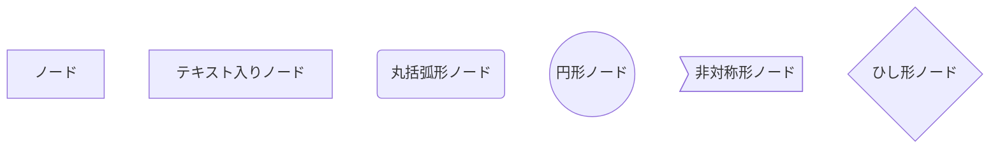
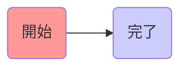
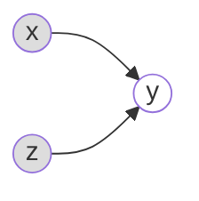
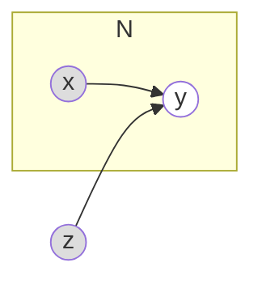

# mermaid.js でノードの形を変更する

括弧を使い別ける事で、ノードの形を変更できるようですね。

```
graph TD
    ノード
    ノード1[テキスト入りノード]
    ノード2(丸括弧形ノード)
    ノード3((円形ノード))
    ノード4>非対称形ノード]
    ノード5{ひし形ノード}
```

こんな感じになるようです。



グラフィカルモデルにおいては、基本的には円形ノードを使っていきます。

# mermaid.js でノードの色を変更する

CSS の記法(?)が使えるようです。

```
graph LR
    start(開始)-->stop(完了)
    style start fill:#f9f
    style stop fill:#ccf
```

こんな感じになります。



また、**ClassDef を使う事で、複数のノードに同一のテーマを適用できる**ようですね。`ノード名:::クラス名`と記述します。

なおグラフィカルモデルにおいては、観測されていない確率変数は塗りつぶさず、観測されている確率変数は塗りつぶして表します。なので、ClassDef で観測変数と見観測変数のスタイルをそれぞれ定義して、使い分けたいです。
(ちなみに既知の定数は塗りつぶした点で表します。)
なので例えば、

```
graph LR
    classDef observed fill:white
    classDef non-observed fill:#EEEEEEE
    x((X)):::non-observed -->y((y)):::observed
```



# 繰り返しのノードを枠で囲む

サブグラフを用いれば、特定のノードを枠で囲める様ですね。
例えばこんな風に。

```
graph LR
    classDef observed fill:white
    classDef non-observed fill:#DDDDDD
    subgraph a[N]
        x((x)):::non-observed --> y((y)):::observed
    end
    z((z)):::non-observed --> y
```


とりあえずこれで何とか、グラフィカルモデルっぽい図は書けそうな気がします。

# 参考

- https://zenn.dev/junkawa/articles/zenn-mermaidjs-theme-config
- CSS カラーコード
  - http://www.netyasun.com/home/color.html
