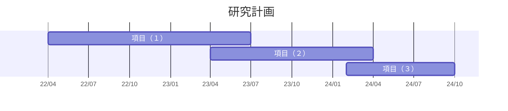

<!--
headingDivider: 1
-->
<!--  -->

# GIS group semi

Morita Masato
2022~

# 2022/04/12

## 前回まで(前年度まで)の進捗

- ストックの現役/退蔵（=建築物ストックの利用状況の違い）を考慮したMSFA
  - （利用の観点からの"ストックの質"）
  - 各建築物ストックが退蔵する確率を予測(記述?)する、退蔵確率モデル。
- ストックの退蔵化(解体されないケース)を考慮した、ストックの滞留年数の予測.
  - 各建築物ストックが解体される確率を予測する、解体確率モデル。
- 福岡県北九州市の各建築物ストックに対して、滞留年数および退蔵ストック化するかどうかの将来シミュレーション。
  - あ

## 今年度以降の研究の方針

### 目的

- ストック型社会に向けた**退蔵ストックの発生メカニズムの解明**と 、 ストックの退蔵を含めた都市物質代謝の将来予測モデルの構築。
- 更に、持続可能な都市構造の検討を目指す。

### アプローチ

- 項目１：画像情報及び位置情報による退蔵ストック検出 (1 年目～2 年目前半)
- 項目２：滞留年数や退蔵ストック発生に関するストック間の空間的相互作用のモデル化(2 年目前半～後半)
- 項目３：ストックの退蔵を含んだ都市物質代謝の将来予測モデルの構築(2 年目後半～3 年目後半)

大体1年目に項目(1)、2年目に項目(2)、3年目に項目(3)という流れ。（前倒しになると思います）




<!-- ```mermaid
gantt
    title 研究計画
    dateFormat YY/MM
    axisFormat %y/%m

    section 項目（１）
    環境構築・アルゴリズム理解    :a1 ,22/04,50d
    現地調査    :a2 ,22/05 ,10d
    アノテーション作業:a3 ,after a2 ,10d
``` -->

```mermaid
flowchart LR
    subgraph 項目1
    id0(車上カメラの映像から<br>学習データ生成) -- Faster R-CNN? -->id1
    id1(画像情報and位置情報<br>から退蔵ストック検出) -- 位置情報を元に<br>GISデータ化? --> id2(退蔵ストックGIS<br>データベースの拡張)
    end
    id1.->id7(Google Street View等から画像を取得できれば...<br>退蔵ストック検出を全国に拡大できる?)

    subgraph 項目2
    id2 --Spatial Durbin<br> Model? -->  id3(退蔵ストック発生に関する<br>空間的相互作用のモデル化)
    id2 -- Spatial Durbin<br> Model?--> id4(滞留年数に関する<br>空間的相互作用のモデル化)
    end

    subgraph 項目3
    id3 --乱数生成?--> id5(ストックの建て替わりと<br>利用状況の変化<br>のシミュレーション)
    id4 --乱数生成?--> id5
    end
    
    id3.-推定されるパラメータを解釈.->id6
    id4.-推定されるパラメータを解釈.->id6
    id5.-複数のシナリオで比較.->id6(どんな都市構造が<br>退蔵ストックの抑制や<br>滞留年数延伸に寄与する?)
```

兎にも角にも、まずは「項目１：画像情報及び位置情報による退蔵ストック検出」に着手していきます。

## 今週の進捗

「項目（１）：画像情報及び位置情報による退蔵ストック検出」における手順を整理すると、以下のようになる？
1. 現地調査によって、車上カメラから建築物の外観を撮影＝＞位置情報付の、建築物の外観の画像データを取得。
2. 撮影した画像に対して、アノテーション作業＝＞学習データを生成。
   - (ex. 画像のどこに物体があるか、その物体は何か、等の情報を各画像に付与する。)
3. 学習データを用いて、画像認識・物体検出モデルを生成。
4. 生成したモデルを、任意の建築物の外観の画像(位置情報付)に適用。その中から「退蔵ストックが検出された画像」を抽出。
5. 「退蔵ストックが含まれる画像」に付与された位置情報を元に、GISデータ化
6. GISデータ化されたものを、都市構造物GISデータと結合。

### 今週は、手順3「学習データを用いて、画像認識・物体検出モデルを生成。」を試してみた。

試しに、小麦の画像の中から、小麦の穂の部分を検出するモデルを生成してみた。

学習データは、以下のような画像＋赤いboxの座標4点()のセット。
.jpg)
## 先生方からのコメント
- 全体のアウトプットの掃出しイメージ。
  - 退蔵ストックの検出。
  - ストック自体のボリュームも分からないと。材料が使われてる。
  - 画像データを建物工法を当てる為にも使える？(＝GISデータの欠損を補う)
  - イギリスの研究もやってる？Google Car。
  - 退蔵ストックが分かった後、廃棄物政策に絡めるには、重量のデータが必要。
  - アウトプットをどこにはきだすか。蛭田先生と一緒に考えて貰う？
  - どういう流れで研究をやってるかを理解する。
- 画像データから得られた出力値を、更に地理的・社会的情報と一緒にインプットするタイプでも面白いかも。
