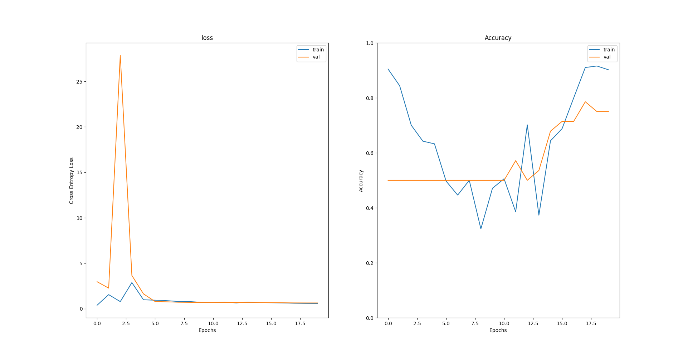
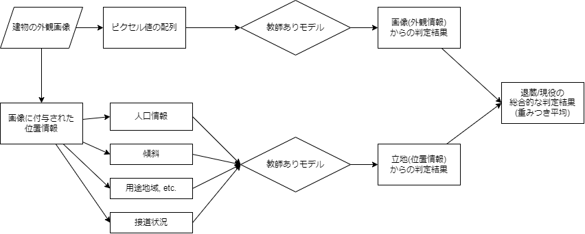
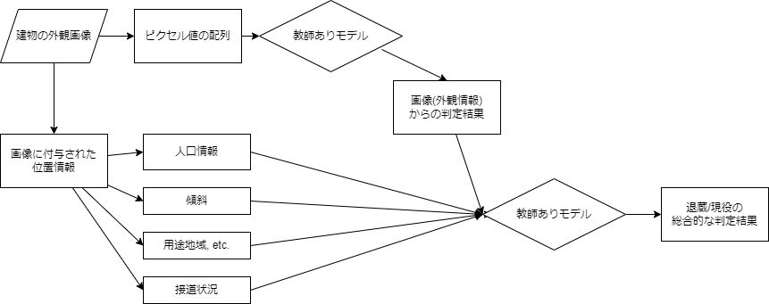
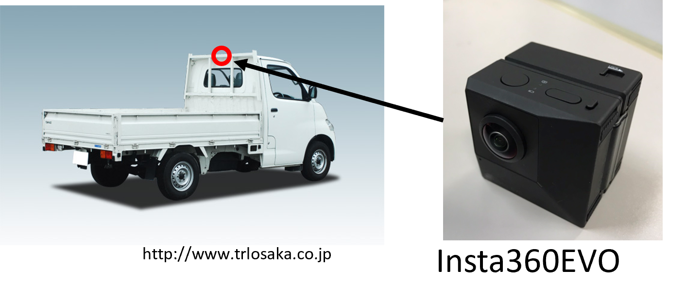
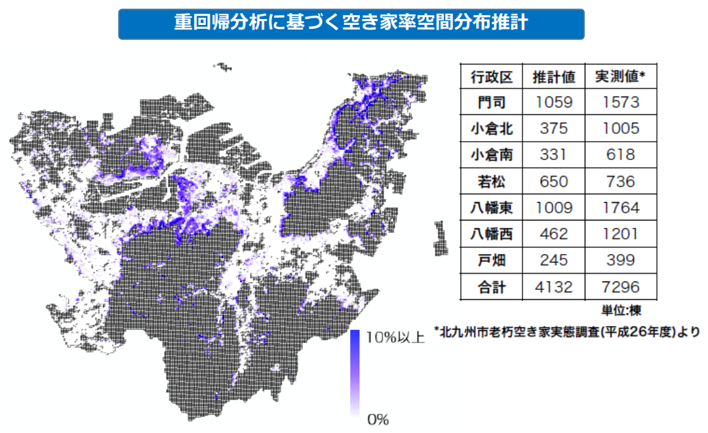
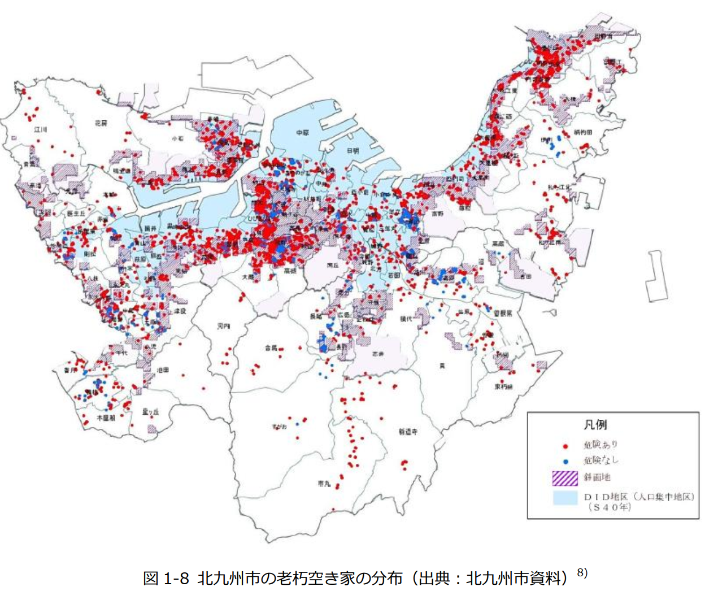
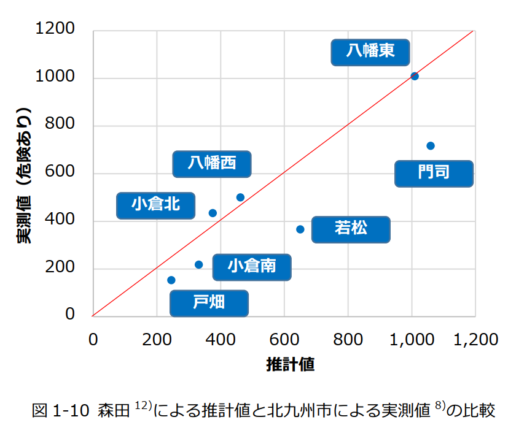
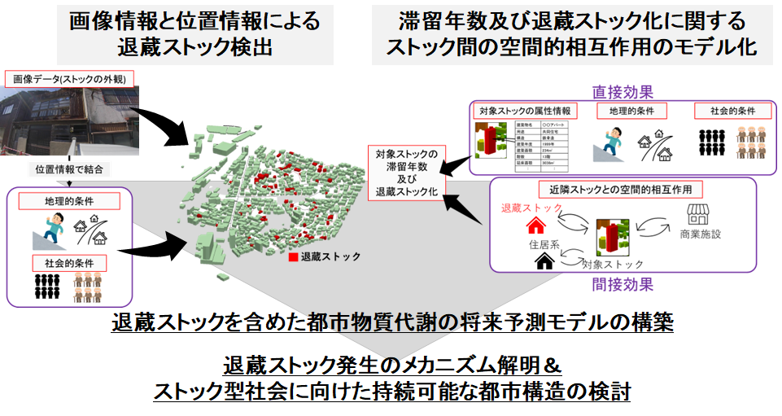
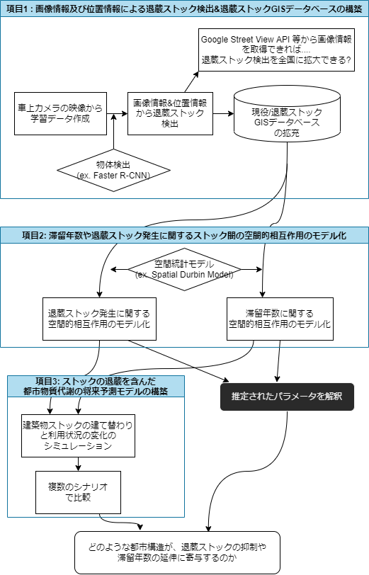

<!--
headingDivider: 1
-->
<!--  -->

# GIS group semi

Morita Masato
2022~

# 2022/04/12

## 前回まで(前年度まで)の進捗

- ストックの現役/退蔵（=建築物ストックの利用状況の違い）を考慮したMSFA
  - （利用の観点からの"ストックの質"）
  - 各建築物ストックが退蔵する確率を予測(記述?)する、退蔵確率モデル。
- ストックの退蔵化(解体されないケース)を考慮した、ストックの滞留年数の予測.
  - 各建築物ストックが解体される確率を予測する、解体確率モデル。
- 福岡県北九州市の各建築物ストックに対して、滞留年数および退蔵ストック化するかどうかの将来シミュレーション。
  - あ

## 今年度以降の研究の方針

### 目的

- ストック型社会に向けた**退蔵ストックの発生メカニズムの解明**と 、 ストックの退蔵を含めた都市物質代謝の将来予測モデルの構築。
- 更に、持続可能な都市構造の検討を目指す。

### アプローチ

- 項目１：画像情報及び位置情報による退蔵ストック検出 (1 年目～2 年目前半)
- 項目２：滞留年数や退蔵ストック発生に関するストック間の空間的相互作用のモデル化(2 年目前半～後半)
- 項目３：ストックの退蔵を含んだ都市物質代謝の将来予測モデルの構築(2 年目後半～3 年目後半)

大体1年目に項目(1)、2年目に項目(2)、3年目に項目(3)という流れ。（前倒しになると思います）


<!-- ```mermaid
gantt
    title 研究計画
    dateFormat YY/MM
    axisFormat %y/%m

    section 項目（１）
    環境構築・アルゴリズム理解    :a1 ,22/04,50d
    現地調査    :a2 ,22/05 ,10d
    アノテーション作業:a3 ,after a2 ,10d
``` -->

```mermaid
flowchart LR
    subgraph 項目1
    id0(車上カメラの映像から<br>学習データ生成) -- Faster R-CNN? -->id1
    id1(画像情報and位置情報<br>から退蔵ストック検出) -- 位置情報を元に<br>GISデータ化? --> id2(退蔵ストックGIS<br>データベースの拡張)
    end
    id1.->id7(Google Street View等から画像を取得できれば...<br>退蔵ストック検出を全国に拡大できる?)

    subgraph 項目2
    id2 --Spatial Durbin<br> Model? -->  id3(退蔵ストック発生に関する<br>空間的相互作用のモデル化)
    id2 -- Spatial Durbin<br> Model?--> id4(滞留年数に関する<br>空間的相互作用のモデル化)
    end

    subgraph 項目3
    id3 --乱数生成?--> id5(ストックの建て替わりと<br>利用状況の変化<br>のシミュレーション)
    id4 --乱数生成?--> id5
    end

    id3.-推定されるパラメータを解釈.->id6
    id4.-推定されるパラメータを解釈.->id6
    id5.-複数のシナリオで比較.->id6(どんな都市構造が<br>退蔵ストックの抑制や<br>滞留年数延伸に寄与する?)
```

兎にも角にも、まずは「項目１：画像情報及び位置情報による退蔵ストック検出」に着手していきます。

## 今週の進捗

「項目（１）：画像情報及び位置情報による退蔵ストック検出」における手順を整理すると、以下のようになる？

1. 現地調査によって、車上カメラから建築物の外観を撮影＝＞位置情報付の、建築物の外観の画像データを取得。
2. 撮影した画像に対して、アノテーション作業＝＞学習データを生成。
   - (ex. 画像のどこに物体があるか、その物体は何か、等の情報を各画像に付与する。)
3. 学習データを用いて、画像認識・物体検出モデルを生成。
4. 生成したモデルを、任意の建築物の外観の画像(位置情報付)に適用。その中から「退蔵ストックが検出された画像」を抽出。
5. 「退蔵ストックが含まれる画像」に付与された位置情報を元に、GISデータ化
6. GISデータ化されたものを、都市構造物GISデータと結合。

### 今週は、手順3「学習データを用いて、画像認識・物体検出モデルを生成。」を試してみた。

試しに、小麦の画像の中から、小麦の穂の部分を検出するモデルを生成してみた。

学習データは、以下のような画像＋赤いboxの座標4点()のセット。
.jpg>)

.jpg>)

## 先生方からのコメント

- 全体のアウトプットの掃出しイメージ。
  - 退蔵ストックの検出。
  - ストック自体のボリュームも分からないと。材料が使われてる。
  - 画像データを建物工法を当てる為にも使える？(＝GISデータの欠損を補う)
  - イギリスの研究もやってる？Google Car。
  - 退蔵ストックが分かった後、廃棄物政策に絡めるには、重量のデータが必要。
  - アウトプットをどこにはきだすか。蛭田先生と一緒に考えて貰う？
  - どういう流れで研究をやってるかを理解する。
- 画像データから得られた出力値を、更に地理的・社会的情報と一緒にインプットするタイプでも面白いかも。

# 2022/04/18

## 前回の進捗

- 新年度の研究計画の整理
- Faster-R CNNを用いた物体検出モデルの実装(試しにオープンソースの画像データを用いて)

## 今週の進捗

- 見せれる報告資料はなし。物体検出アルゴリズムの情報収集。
- 「手法」の部分にフォーカスしすぎず、最終的なアウトプット＝「目的」の部分もしっかり意識するように。

## 今後の予定

- 物体検出アルゴリズムの情報収集を継続。
- 現地調査(=映像データ収集)に関しても、具体的に準備を進めていく
  - 360度カメラの撮影テスト、映像データ(位置情報付)の操作・抽出のテスト。
  - 現地調査の対象地域の選定
  - ,etc.

## アドバイス

- 長尾先生との連携.
  - Glass wallの話＝＞全国拡張。
  - Glass Wallに限った話ではないが、どうせ空き家が分かった後、重量を推定するには、構造の判定をする必要がある。
    - ＝＞退蔵/現役を考慮したMS推計を全国展開するには、建物工法の情報も推定する必要がある！
    - 空き家モデルの全国展開を見越すと、建物工法の判定を含めた方がいい！
- 土木は

# 2022/05/24

## 前回まで(前年度まで)の進捗

## 今週の進捗

- 学振 申請書の執筆作業(学内締め切り5/26)
- ISIE-SEM Conferenceの口頭発表(修士研究の内容)がaccept
- 修士研究の内容をどうにか論文化する必要がある??(ISIE-SEM Conferenceの前に...)
  - 投稿雑誌(Journal)の選択：
    - Scope(どのような論文を求めているか)を読んで決める？？
    - Environmental Science & Technology
    - **Journal of Industrial Ecology**
    - Resources, Conservation & Recycling
  - 学術論文の形態(Paper Style)の選択
    - Regular Article （通常の学術論文）かレター（Letter）
    - 現在進行系の研究成果(D1～の研究に繋がる)なので、**レター論文の方がいい**?

## 今後の予定

- 学振提出
- 修士研究の論文投稿
- 北九州市での画像データ収集

# 2022/05/31

## 前回までの進捗

- 学振 申請書の執筆作業(学内締め切り5/26)
- 修士研究の内容を論文化し始める

## 今週の進捗

- 修士研究の内容を論文化作業
  - 既存研究のサーベイ
- Inuse / Obsolete の画像認識モデル
  - 元々の自分の考えでは...
    - 車上から撮影された画像から、まず「画像の中の、建物を検出」して、その後「その建物が現役/退蔵かを分類」するタスク。
  - Zhiweiさんからのアドバイス
    - まず初めに、後者のタスク「その建物が現役/退蔵かを分類」を試してみては？発展として、前者のタスクも含めてみては？
      - ＝すなわち、予め「建物が一棟 写っている画像」を用意して、その画像(=建物)が「現役/退蔵かを分類」するタスク

なので、建物が写った画像を「現役/退蔵かに分類」するタスクを、「データ読み込み=>データの加工=>モデルの学習=>未学習データに対する推論」まで、一連の処理を実装してみる。(一連の処理がすでに実装できていれば、現地調査を経て実データを作成した後、すぐにモデリングに回せる)

- 2種類(現役 & 退蔵)の建物の画像を用意。

  - 実際には、現地調査で得られた車上カメラからの映像から、画像を切り出して、各画像を「現役」「退蔵」に分類しておく。
  - 今回は、以下のサンプル画像を**学習用データ**として用意して、一連の処理を実装してみる。

    - 現役ストック
      - 
      - 
    - 退蔵ストック
      - 
      - 

  - また同様に、**検証用データ(学習に使用しないデータ)**として以下のサンプルを用意。検証用データを用いて、分類モデルの汎化性能(=未学習データに対するモデルの性能)を評価する。
    - 
    - 
    - 
    - 

- 画像データのData Augmentation(データ量の水増し)

  - Data Augmentation：
    - 既存のデータセットからデータ数を拡張する方法論。
    - ex)画像の水平反転、輝度変更, etc.
  - zhiweiさんからのアドバイス：
    - 分類タスクでは、分類対象の各クラス(ex. 現役, 退蔵)のデータ数が大きく異なる(ex. orderが10000と100, etc.)と、学習が上手くいかない。
    - ＝＞何らかの工夫が必要
  - ＝＞特に本研究「退蔵ストック検出」の場合、**退蔵ストックの数が現役ストックの数に比べて少ない**。(2020年の現地調査においても、現役ストック約2000棟、退蔵ストック約70棟)
    - Data Augmentationを用いて、データ数の差を補う事で対処可能？
    - ex)
      - 
      - 
  - 上記の処理を、画像認識の一連の処理の中に挟む。
    - 「データ読み込み=>データの加工(+「退蔵」クラスに関してはデータ拡張)=>モデルの学習=>未学習データに対する推論」

- 現役/退蔵の画像認識モデルを学習させてみる。
  - 結果(20 epoch = 学習用データを20周学習)
    - 正解率(正解数/全画像数): 学習用データ=0.9019, 検証用データ= 0.7500
    - 1 epoch毎の
    - 
  - => 今回は、Google street viewから拾ってきた数枚の画像のみで学習させた為かなりラフだが、外観から判断できる現役/退蔵は、画像認識モデルによってある程度(8割弱)判定できそう?
  -

```
image_recognition_obsolete_or_inuse
├─images_inuse_obsolete
│  ├─train (ここに学習用画像を入れる)
│  │  ├─inuse
│  │  └─obsolete
│  └─valid (ここに検証用画像を入れる)
│      ├─inuse
│      └─obsolete
└─judge_obsolete_inuse
    └─__pycache__

```

## 今後の予定

- 修士研究の論文投稿(7月中の投稿)
- 北九州市での画像データ収集
  - カメラの操作方法を確認
  - 調査実施場所の選定
  - (東さんとコンタクトを取りつつ、実施時期・場所の計画, 6月実施を目指す)

## アドバイス

- ほぼ同じ事を長尾先生もやってる?連携させてやらないと
  - 長尾先生と話??
- 調査に関しても
  - データを闇雲にとっても..
  - これも長尾先生と話?
- 物体検出用のライブラリはすでに出てる
  - どんなライブラリを使う?
  - 技術も身につくし、業績にもなるような事を相談?
- 学習データに関しては、難易度の高いものを入れたほうがいいかも。
  - 今回のサンプルの例だと、和風vs 洋風みたいな感じにもなってる.
- 長尾先生と打ち合わせの調整できませんか??
  - 長尾先生は画像分析の方からアプローチ?
  - 自分は地理情報からのアプローチ??
  - 画像データだけでは難しいから…地理情報も含める??
- 画像認識モデルの結果=>変数に。
- 東さんがGoogle Earthで色々画像を集めてくれてる?=>後で共有してくれる.

# 2022/06/14

## 研究テーマ

### 目的

- ストック型社会に向けた**退蔵ストックの発生メカニズムの解明**と 、 ストックの退蔵を含めた都市物質代謝の将来予測モデルの構築。
- 更に、持続可能な都市構造の検討を目指す。

### アプローチ

- 項目１：画像情報及び位置情報による退蔵ストック検出
- 項目２：滞留年数や退蔵ストック発生に関するストック間の空間的相互作用のモデル化
- 項目３：ストックの退蔵を含んだ都市物質代謝の将来予測モデルの構築

## 前回までの進捗

- 修士研究の内容を論文化し始める
- 退蔵/現役の画像認識モデルを実装してみた

## 今週の進捗

見せられる結果は特になし。

- 修士研究の内容を論文化作業
  - 既存研究のサーベイ
- 長尾研究室との連携
  - 今週末に打ち合わせを予定
  - 退蔵/現役に関する画像認識/物体検出モデルの実験の情報共有
  - 今後の研究計画と現地調査の計画に関して相談。
- 画像認識/物体検出の出力結果に対して、地理情報データを結びつける方法に関して
  - 方法1:
    - 元々、研究計画の際に想定していた方法
    - 外観情報ベースと位置情報ベースでそれぞれ、退蔵/現役を予測するモデルを構築=>それらの出力値の平均(重み付け)を最終的な出力値に。
    - 
  - 方法2
    - 外観情報ベースで教師ありモデルを構築。＝＞その出力値(外観からの判定結果)を特徴量の一つとして、人口情報・地理的条件, etc.と一緒に教師ありモデルを構築=>最終的な出力値(判定結果)。
    - 
  - 実験して精度が高い方法を選択する? 解釈しやすい方法を選択する?

## 今後の予定

- 今週金曜, 長尾研究室との打ち合わせ
- 修士研究の論文投稿(7月中の投稿)
- 北九州市での画像データ収集(6月中を想定)
  - カメラの操作方法を確認
  - 調査実施場所の選定
  - (東さんとコンタクトを取りつつ、実施時期・場所の計画, 6月実施を目指す)

# 2022/06/22

### 研究計画「持続可能なストック型社会の構築へ向けた都市構造物の退蔵ストックの発生メカニズムの解明と将来予測モデルの開発」におけるアプローチ

- 項目１：画像情報及び位置情報による退蔵ストック検出
- 項目２：滞留年数や退蔵ストック発生に関するストック間の空間的相互作用のモデル化
- 項目３：ストックの退蔵を含んだ都市物質代謝の将来予測モデルの構築

## 2022/06/17 長尾研究室 打ち合わせを経て

### 現地調査を実施する前に<360度映像について>

自動車の屋根上に360度カメラを取り付け、撮影しながら走行する事で、効率的に建築物ストックの外観画像を収集する。
また、自動車の侵入が困難、且つ老朽空き家の存在が予想される地域は、徒歩と360度カメラによる調査を行う。



- 使用機器：Insta360 one x
- 現時点で確認できている事。
  - 360度全方位の映像を撮影可能。
  - GPS情報(位置、高さ、速度、etc.)を映像に付与可能。
    - https://www.insta360.com/jp/support/supportcourse?post_id=10894
    - GPSデータを記録するには、リモコンがGPS信号を受信するまで屋外で動かさずにしばらく待つ必要があるらしい
      - https://tohasen.com/actioncamera/insta360-ja-2/one-r-accessory/gps-gps-smart-remote/
- 現時点で未確認・調査までに確認すべき事。
  - 映像に付与されたGPS情報を、映像ファイルから抽出・取得する方法。
    - 長尾先生によると、「以前調査で使用したGoProでは、位置情報の抽出が困難だった」との事。
    - Insta360の公式のアプリケーションではサポートしていないとの事。(2021年11月時点)
      - https://forums.insta360.com/section/14/post/5415/
    - 外部のアプリケーションを使って抽出した例があるらしい...。
      - ExifTool（画像や動画等のメディアファイルからメタデータを取得できるツール）
      - https://exiftool.org/forum/index.php?PHPSESSID=ee21d78b08eb29c8361710dbff6d1e3a&topic=9884.0
      -
  - 360度の映像ファイル(独自のファイル拡張子)を、映像の形式(全方位, 歪みなし)を保ったまま変換する方法。====> これはクリア！！
    - 長尾先生によると、「GoProの場合は、全方位の映像を歪みなしでmp4形式に変換する方法が存在する」との事。
    - Insta360の公式のアプリケーションで変換可能との事。(卒業研究時は失敗した記憶あり。ファイルの変換は可能だが、全方位映像の歪みが発生した記憶が...。)
    - https://hyakuyattsu.com/photo/camera/insv-mp4


### 現地調査の実施場所に関して

- 元々は、卒業研究の結果から、推計値と実測値の乖離が大きい門司区・若松区を主な実施場所として選定する予定だった。

  - 2020年の現地調査にて得られた観測データを元に推定された老朽空き家の空間分布
    - 
  - 2014年に行政によって実施された北九州市老朽空き家実態調査の結果
    - 
  - 推計値と北九州市による実測値の比較
    - 

- 打ち合わせにて
  - 「東さん始めエックス都市研究所の方々が(Google street viewで?)調査した老朽空き家の位置情報を元に、調査ルートを設定してはどうか」
  - (確実に、老朽空き家(退蔵ストック)のサンプルデータ(100~200件)を取得できる為)

### 画像情報(ストックの外観)ベースの予測結果と地理情報(ストックの位置)ベースの予測結果の結合について:

- 基本的には、全国データへの適用を前提とする。
- 地理情報ベースの予測モデルに関して、北九州市以外では取得困難な情報(i.e. 主に”建物年齢”や"建物工法")は採用しない方針。
- 特に"建物年齢(建築年)"は、全国的には取得がかなり困難な情報。
  - ＝＞「この**"建物年齢"を代替する情報**としても、画像情報(ストックの外観)を用いる」というモチベーション・解釈は納得感がある。

### 「**旗竿地か否か**」の判定方法に関して

- 地理情報ベースの退蔵ストック検出に関連して、「**旗竿地か否か**」の判定方法が重要 and そこに工夫の余地があるのでは...?
  - 旗竿地とは
    - 路地状の細長い空間("竿"部分)のみで建築基準方に基づく2mの接道条件を満たし、道路に直接接していない"旗"部分に住居を建てている敷地。
    - 
- 考えられる「**旗竿地か否か**」の判定方法(各建築物に「**旗竿地か否か**」の情報を付与する方法。)

  - ルールベースの「旗竿地」検出。
    - ex)道路との最短距離が〇〇m以下の建築物を「旗竿地」とみなす。(卒業研究の際に使用していた検出方法)
  - 建築物の地理情報を説明変数として、「旗竿地」を分類する統計or機械学習モデル
  - 建築物&道路網のGISデータを画像として扱って、画像中の「旗竿地」を検出する物体検出モデル

- 結局は建て替えにくさ。(整形街区の旗竿地、不整形な田舎の街区の旗竿地?)

# 2022/07/06

## 研究計画「持続可能なストック型社会の構築へ向けた都市構造物の退蔵ストックの発生メカニズムの解明と将来予測モデルの開発」におけるアプローチ

- 項目１：画像情報及び位置情報による退蔵ストック検出
- 項目２：滞留年数や退蔵ストック発生に関するストック間の空間的相互作用のモデル化
- 項目３：ストックの退蔵を含んだ都市物質代謝の将来予測モデルの構築

## 前回までの内容

## 今週の進捗

### 「**旗竿地か否か**」の判定方法に関して

- 地理情報ベースの退蔵ストック検出に関連して、位置情報から「建て替えにくさ」を表す指標の一つとして「**旗竿地か否か**」の判定方法が重要 and そこに工夫の余地があるのでは...?

  - 旗竿地とは
    - 路地状の細長い空間("竿"部分)のみで建築基準方に基づく2mの接道条件を満たし、道路に直接接していない"旗"部分に住居を建てている敷地。
    - 
  - 既存研究(岸川ら(2016)による旗竿敷地の分布)
    - 旗竿敷地の定義を「**前面道路の間口が狭く通路型の敷地で接する敷地**」と定義し、2013年のゼンリン住宅地図から戸建て住宅の旗竿敷地を確認。
    - 
    - 
    - 

- GISデータにおいて「旗竿地か否か」を判定する視覚的な特徴。
  1. (地図上に描画されている)道路と建築物との距離。
  2. 対象の建築物の近傍の道路の幅。
  3. 対象の建築物と近傍の道路の間に他の建物が存在するか否か。
  4. 整形街区の場合は、街区の縦横比。(正方形か長方形か)
  5. 不整形街区において、行き止まりの道路。("竿"部分が描画されているケース)
- ＝＞1, 2に関しては、建築物GISデータと道路GISデータを空間結合する事で、各建築物フィーチャの属性情報として**定量的に**表現する事が容易。
- 一方で3, 4, 5に関しては、各建築物フィーチャの属性情報として**定量的に**表現するのが困難。
  - =>各フィーチャ(対象の建築物、周囲の建築物、周囲の道路, etc.)の位置関係を画像データとして扱う事で、3,4,5を容易に表現できるのでは?
  - =>人間が地図上から視覚的に判断できるような「建築物の"接道状況の良し悪し"や"建て替えにくさ"」を、定量的な属性情報として表現できるのでは?

### 各建築物フィーチャに対して、周囲の都市構造物との位置関係を画像化してみる。


各建築物フィーチャの周囲の構造物との位置関係の画像の内容(描画ルール)は以下。

- 対象の建築物フィーチャ：赤線
- 周囲の建築物フィーチャ：黒線
- 周囲の道路フィーチャ：青色
- 対象の建築物フィーチャの重心を画像の中心として、中心から緯度経度±〇〇°の範囲を画像として描画。

また、教師ラベルとして、建築物フィーチャ2000棟に対して「旗竿敷地か否か(1 or 0)」を属性情報として付与。(岸川ら(2016)による基準を参考に手作業)

入力=「建築物フィーチャの周囲との位置関係を表す画像」、出力=「旗竿敷地か否か(1 or 0)」とする教師ありMLモデル(恐らくCNNベースの手法)を学習させる。

任意の「ある建築物フィーチャの周囲との位置関係を表す画像」に対して、「視覚的に判断された(上述の1~5の特徴を含んだ)」"旗竿地らしさ(っぽさ)"の評価値(0~1)を表現する事ができるのでは...?

### 現地調査の実施場所に関して

- 東さん始めエックス都市研究所の方々が調査した老朽空き家の位置情報から、老朽空き家の存在箇所ポイントデータを作成。
-

## 今後の予定

- 現地調査を実施する前に<360度カメラについて>確認事項
  - 位置情報の抽出方法
  - 360度画像の変換方法
- 修士研究の論文投稿(7月中の投稿)
-

# アドバイス

- 東さんにteamsを通して連絡を取る。(今週やっとく)
  - 向こう
- 使用するデータに、どの程度生活道路(ex.階段状道路、竿部分)が含まれているかどうか確認すべき。
  - Google mapと重ねたりして。空き家がたくせん発生してるエリアでチェックしてみるといい。
  - 少なくともはじめはできるかぎり、生活道路が描かれた道路データを使用した方が良い。
  - あくまで目標は「建て替えのしづらさ」。"旗竿地"は、それを表現する為の代理指標の一つ！
  - 結局はアクセスのしにくさ。＝＞それを表現する事が重要。
    - 次回までに、いかに「旗竿地か否か」の判定を「建て替えのしづらさ=位置情報ベースでの退蔵ストック判定」につなげるかを報告できるように！
- 現地調査や、事例を確認するのも大事。

# 2022/07/20

# 「旗竿地か否か」の判定は、どのようにして「建て替えのしづらさ=>位置情報ベースでの退蔵ストック判定」に繋がるのか、を一度整理する。

## 研究計画の振り返り

### 研究テーマ
「持続可能なストック型社会の構築へ向けた都市構造物の退蔵ストックの発生メカニズムの解明と将来予測モデルの開発」
### 目的

- ストック型社会に向けた**退蔵ストックの発生メカニズムの解明**と 、 ストックの退蔵を含めた都市物質代謝の将来予測モデルの構築。
- ストック型社会の観点から、持続可能な都市構造の検討を目指す。

### アプローチ

- 項目１：画像情報及び位置情報による退蔵ストック検出&退蔵ストックGISデータベースの構築
- 項目２：滞留年数や退蔵ストック発生に関するストック間の空間的相互作用のモデル化
- 項目３：ストックの退蔵を含んだ都市物質代謝の将来予測モデルの構築




<div style="page-break-before:always"></div>

### 各項目の関係性



<div style="page-break-before:always"></div>

## 「旗竿地か否か」の判定は、どのようにして「建て替えのしづらさ=位置情報ベースでの退蔵ストック判定」に繋がるのか

「旗竿地か否か」の判定は、項目1「画像情報(ストックの外観)及び位置情報による退蔵ストック検出」に関連する。

「退蔵ストックである可能性が高いか否か」をストックの位置情報から判定する際に表現される(考慮される)べきことは、「仮に対象のストックがinuse=>out of useに変化した際に、退蔵ストックになりそうか否か」だと考えられる。

「仮に対象のストックがinuse=>out of useに変化した際に、退蔵ストックになりそうか否か」を決定する要因としては以下が考えられる。
- 物理的な建て替えづらさ
  - (ex. 接道状況が悪く、解体用の機械の侵入が困難なケース)
  - 斜面地、道路幅員の狭さ、階段状の道路
  - 旗竿地か否か。
- 物理的ではない(社会・経済的な？)建て替えづらさ(**土地の需要・魅力**)：
  - (ex. 解体作業は容易だが、解体後の土地の需要がないケース)
  - 周囲の人口情報（人口増加中の地域か否か、高齢化が進む地域か否か）
  - 駐車場(空き家解体後の土地利用先の一つ)の需要があるか否か
  - 公共交通利便性
  - 都心部からの距離
  - 斜度
  - 接道状況

## 結論「旗竿地か否か」の検出自体は重要ではないが...!

前回のGroup semiでは、「『旗竿地か否か』の検出精度を高める為に画像認識モデルを用いるべき...!」という考えだった。

しかし、『旗竿地か否か』の検出精度そのものは退蔵ストックの検出に関して、重要度は高くはない。

一方で、「『旗竿地か否か』を教師ラベルとした画像認識モデル」の出力値を、建築物ストックの「建て替えづらさ」を表す代理指標の一つとして活用する事(i.e. 位置情報ベースの退蔵確率モデルの説明変数の一つとする事)は有用だと考えられる。

というのも、下記の3つの建築物ストックは建て替えづらさ(物理的&社会・経済的)が異なると考えられる。

- 
- 
- 

これら**3つのストックの接道状況(対象の建築物 & 周囲の建築物 & 道路 の位置関係)の違いを、定量的な数値として**表して、「ストックの建て替えづらさ」、すなわち位置情報ベースの退蔵ストックの判定に使用したい。

上記の違いを、定量的な数値として表す為の手段として、「『旗竿地か否か』を教師ラベルとした画像認識モデル」の出力値を利用する方法が適切だと考えられる。
(上記の画像データから、対象の建築物 & 周囲の建築物 & 道路 の位置関係の特徴を抽出して、n個の定量的な評価値で表す)

## アドバイス
- やりかたが雑？
  - Esriのデータだけでなく、他のデータも比較。国交省の基盤地図情報。
  - ラスターも使える。
- 最終目標に向かって、どういうスケジュールでやっていくか。
- 重要性とオリジナリティ。せっかく皆で議論できる場だから、こういう事やろうとしてますだけではなく、結果くらいまで見せられたら！！
- 論文として出す事も重要。今の状況が一歩進んだ(進捗が出た)状況で、論文が出せる事を想定して。
  - どういう
- ヘドニック分析も参考になるかも。
- 建物の位置関係について
  - 景観生態学
  - 画像を用いない評価方法もある。
- 物理的？言葉の使い方が？地理的vs社会経済的
  - 地盤が