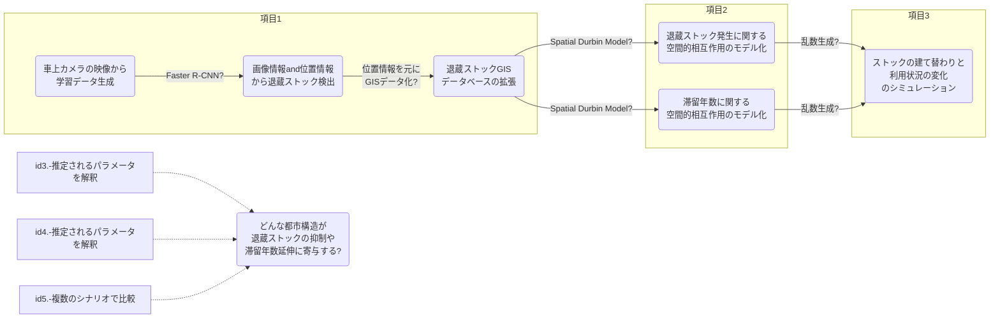

<!--
headingDivider: 1
-->
<!--  -->

# GIS group semi

Morita Masato
2022~

# 2022/04/12

## 前回まで(前年度まで)の進捗

- ストックの現役/退蔵（=建築物ストックの利用状況の違い）を考慮したMSFA
  - （利用の観点からの"ストックの質"）
  - 各建築物ストックが退蔵する確率を予測(記述?)する、退蔵確率モデル。
- ストックの退蔵化(解体されないケース)を考慮した、ストックの滞留年数の予測
  - 各建築物ストックが解体される確率を予測する、解体確率モデル。

### 課題：

-

## 今年度以降の研究の方針

### 目的

- ストック型社会に向けた**退蔵ストックの発生メカニズムの解明**と 、 ストックの退蔵を含めた都市物質代謝の将来予測モデルの構築。
- 更に、持続可能な都市構造の検討を目指す。

### アプローチ

- 項目１：画像情報及び位置情報による退蔵ストック検出 (1 年目～2 年目前半)
- 項目２：滞留年数や退蔵ストック発生に関するストック間の空間的相互作用のモデル化(2 年目前半～後半
- 項目３：ストックの退蔵を含んだ都市物質代謝の将来予測モデルの構築(2 年目後半～3 年目後半)

大体1年目に項目(1)、2年目に項目(2)、3年目に項目(3)という流れ。（前倒しになると思います）


兎にも角にも、まずは「項目１：画像情報及び位置情報による退蔵ストック検出」に着手していきます。

<!-- ```mermaid
gantt
    title 研究計画
    dateFormat YY/MM
    axisFormat %y/%m

    section 項目（１）
    環境構築・アルゴリズム理解    :a1 ,22/04,50d
    現地調査    :a2 ,22/05 ,10d
    アノテーション作業:a3 ,after a2 ,10d
``` -->



## 今週の進捗

「項目（１）：画像情報及び位置情報による退蔵ストック検出」の達成に向けて、まずタスクを整理します。

## 先生からのコメント
- aaa
- aaa
