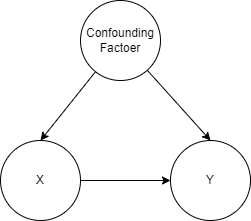

<!--  -->

# **Backdoor Criterion**

### バックドア基準

### Things to keep in mind when you want to discuss "Causal Relation" through regression analysis

回帰分析を通して因果関係を議論したい時に注意すべきこと

2022/05/08 Whole seminar
Masato MORITA

---

# Today's My Objective

I want to share one of the idea of **Statistical Causal Inference**: it is the field of analysing causal relation from observed dataset.

### (dear user of regression analysis)

aaa

### (dear not user of regression analysis)

aaa

---

# What is Causal Relation?

---

# What is Regression Analysis?

It's super overview version:satisfied:

$$
\mathbf{y} =
$$

---

# What is Linear Regression Analysis?

It's a little bit mathematical version:satisfied:

$$
\mathbf{y} = f(\mathbf{x_1}, \cdots, \mathbf{x}_k) \\
= \beta_0 + \beta_1 \mathbf{x}_1 + \cdots + \beta_k \mathbf{x}_k + \mathbf{\epsilon}
= \mathbf{\beta}X + \mathbf{\epsilon}
$$

here is ...

- $\mathbf{y}$ : (in Causal Inference, it should be "outcome")
- $X$ : (in Causal Inference, it should include "cause")
- $\mathbf{\beta}$ : the regression coefficent of $X$.
- $\mathbf{\epsilon}$ : yのうち、確率的に変動する成分。

---

# the usage of Regression analysis

the usage of Regession analysis is separated mainly three objectives:

- Prediction
- Description
- Control / Intervention

---

# Reference
- "河川 亜鉛濃度 原因"で検索
- "河川 BOD濃度 原因"で検索
- 

---

<!-- _class: title -->

# Thank you for your listening!

## Please enjoy your analysis life:satisfied:
