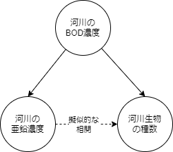

<!--  -->

# **Confounding Factor**

### 交絡因子

### Things to keep in mind when you want to discuss "Causal Relation" through regression analysis

回帰分析を通して因果関係を議論したい時に注意すべきこと

2022/05/08 Whole seminar
Masato MORITA

---

# First of all, **Why I chose this topic**??

### 1. 最近、研究活動で回帰分析を使用するメンバーが増えてきた印象

### 2. 最近、統計的因果推論の本を読んで、回帰分析を使った因果関係の分析方法を知ったので、軽く情報共有したい...!

---

# Today's My Objective

I want to share one of the idea of **Statistical Causal Inference**: it is the field of analysing causal relation from observed dataset.

### (dear user of regression analysis)

回帰分析で得られた偏回帰係数の値を、因果推論の観点から解釈する時の注意点を知ってほしい。

### (dear not user of regression analysis)

観測データを元に2つの要素の因果関係を評価する際、私達を誤解させるかもしれないパターンを知ってほしい。

---

# Outline

### 1. What is causal relation? What is regression analysis?

因果関係ってなんだっけ？回帰分析ってなんだっけ？

### 2. When is **regression coefficients** different from **causal effects**? When is fitted??

どんな場合に回帰係数の値と因果効果の値がズレる？どんな時に一致する？？

---

<!-- _class: title -->

# 1. What is causal relation? What is regression analysis?

因果関係ってなんだっけ？回帰分析ってなんだっけ？

---

# What is Causal Relation?

---

# What is Regression Analysis?

It's overview version:satisfied:

$$
\mathbf{y} =
$$

---

# What is Linear Regression Analysis?

It's a little bit mathematical version:satisfied:

$$
\mathbf{y} = f(\mathbf{x_1}, \cdots, \mathbf{x}_k) + \mathbf{\epsilon}\\
= \beta_0 + \beta_1 \mathbf{x}_1 + \cdots + \beta_k \mathbf{x}_k + \mathbf{\epsilon}
= \mathbf{\beta}X + \mathbf{\epsilon}
$$

here is ...

- $\mathbf{y}$ : (in Causal Inference, it should be "outcome")
- $X$ : (in Causal Inference, it should include "cause")
- $\mathbf{\beta}$ : the regression coefficent of $X$.
- $\mathbf{\epsilon}$ : yのうち、確率的に変動する成分。

---

# the usage of Regression analysis

the usage of Regession analysis is separated mainly three objectives:

### Prediction

### Description

### Control / Intervention

from viewpoint of "Causal Inference", regression analysis is utilized for "Description" and "Control/Intervention".
Mainly

---

<!-- _class: title -->

# 2. When is **regression coefficients** different from **causal effects**? When is fitted??

どんな場合に回帰係数の値と因果効果の値がズレる？どんな時に一致する？？

---

# Let's imagine the case of saving Biological Diversity

私達は、河川の生物の保全の為に「生物の種数」と河川中の環境汚染物質について調査する事にした。

- 河川中の「生物の種数」と「亜鉛濃度」に、負の線形的な相関関係が見られた。
- この時、「高濃度の亜鉛は多くの水生生物に対して毒性を持つ」という一般的な知見を考慮に入れると、「亜鉛濃度の増加＝＞生物の種類の減少」という因果関係を想起するは自然な事かもしれない。

---

# quantification causal effect by regression analysis

ここで「生物の種数」に対して、「亜鉛濃度」を説明変数とした単回帰モデル

$$
生物の種数 = \beta \times 亜鉛濃度 + intercept + \epsilon
$$

を用いた解析をしてみると、その単回帰係数$b$は「-1.01」だった。

So causal effect is -1.01??

---

# So we can guess...

---

# However...

しかしながら、更に調査を進めていくと、河川の有機物による汚濁(BOD濃度)についても、「底生生物の種数」と負の線形な相関関係が見られる事が分かった。

- これを見る限りは、「BOD濃度の増加=>底生生物の種数の減少」という因果関係もありえそう...。

ここで果たして、「亜鉛が河川生物の種数を減らしている」と言えるのか？

---

# In actual...There is "Confounding"

 So causal effect is close to 0.0.

---

# check Confounding using regression analysis

結果変数を「底生生物の種数」、説明変数を「亜鉛濃度」と「BOD濃度」とした重回帰分析を行ってみる。

すると、「亜鉛濃度」の偏回帰係数$b$はほぼゼロになり、「亜鉛濃度」の影響は認められなくなってしまった。
この事から、「亜鉛濃度」と「底生生物の種数」の相関関係は交絡によるものであり、亜鉛そのものによって生じているのではない事が推測できる。

---

# What I mean...

- 観測データから因果関係を議論する時は交絡因子に注意する！
- 回帰分析の偏回帰係数から因果効果を推定する際は、交絡因子を考慮し、交絡因子を説明変数に加える！
- 2つの要素間の因果関係を議論する際は、2つの要素だけを見ていてはいけない！周囲の因果ダイアグラムを考える必要がある。

---

# Reference

- "河川 亜鉛濃度 原因"で検索
- "河川 BOD濃度 原因"で検索
- ***

---

<!-- _class: title -->

# Thank you for your listening!

## Please enjoy your analysis life:satisfied:
