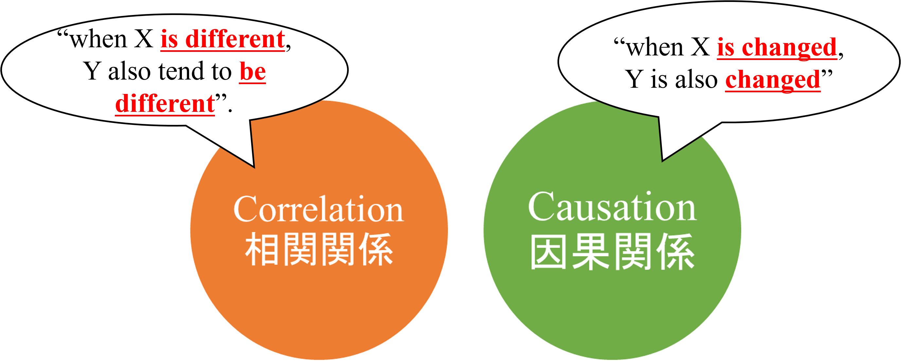
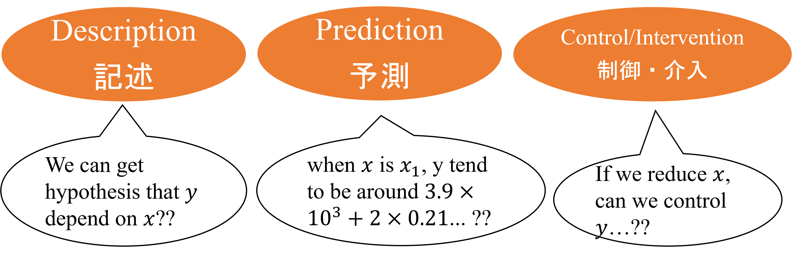
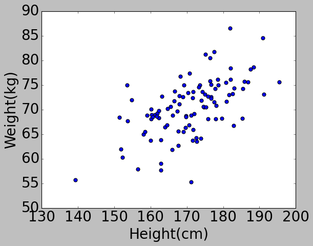

<!--  -->

# **Confounding factor**

### 交絡因子

### Things to keep in mind when you want to discuss "Causal Relation" through regression analysis

回帰分析を通して因果関係を議論したい時に注意すべきこと

2022/05/08 Whole seminar
Masato MORITA

---

# First of all, **Why I chose this topic**??

### 1. I have the impression that more and more members are using regression analysis in their research activities these days.

### 2. I recently read a book on statistical causal inference and learned how to analyze causality using regression analysis, so I want to share some light information...!

---

# Today's My Objective

I want to share one of the idea of **Statistical Causal Inference**: it is the field of analysing causal relation from observed dataset.

- (dear user of regression analysis)

  - I want to share what we should careful when interpreting the value of regression coefficient obtained in the regression analysis in terms of causal inference.

- (dear not user of regression analysis)
  - I want to share the patterns that may mislead us when evaluating causality based on observational data.

---

# Outline

### 1. What is causal relation? What is regression analysis?

因果関係ってなんだっけ？回帰分析ってなんだっけ？

### 2. When is **regression coefficients** different from **causal effects**? When is fitted??

どんな場合に回帰係数の値と因果効果の値がズレる？どんな時に一致する？？

---

<!-- _class: title -->

# 1. What is causal relation? What is regression analysis?

因果関係ってなんだっけ？回帰分析ってなんだっけ？

---

# What is Causal Relation?

- The definition of causal relation is ...
  - causal relationship between 'cause' and their ''outcome.
- The difference with correlation is ...
  

---

# What is Linear Regression Analysis?

It's a little bit mathematical :satisfied:

$$
\mathbf{y} = f(\mathbf{x_1}, \cdots, \mathbf{x}_k) + \mathbf{\epsilon}\\
= \beta_0 + \beta_1 \mathbf{x}_1 + \cdots + \beta_k \mathbf{x}_k + \mathbf{\epsilon}
= \mathbf{\beta}X + \mathbf{\epsilon}
$$

where is ...

- $\mathbf{y}$ : (in Causal Inference, it should be "outcome")
- $X$ : (in Causal Inference, it should include "cause")
- $\mathbf{\beta}$ : the regression coefficent of $X$.
- $\mathbf{\epsilon}$ : yのうち、確率的に変動する成分。

---

# the usage of Regression analysis

the usage of Regession analysis is separated mainly three objectives:

from viewpoint of "Causal Inference", regression analysis is utilized for "Description" and "Control/Intervention".

---

# Example: height=>weight

##### In this case, $\beta_1$ can be interpret 'causal effect' of 'height' to 'weight' on average.

##### However, the value of the regression coefficient **does not necessarily fit** with the causal effect.

---

# 2. When is **regression coefficients** different from **causal effects**?

there are mainly 4 cases :

#### 1. Cases where the **direction of causation** is **opposite**

#### 2. Cases where **a common factor exists upstream** of the causation

#### 3. Cases where the factors **are selected at the confluence** of causes and effects

#### 4. Cases in which **intermediate variables are included**

---

# Let's imagine the case of saving Biodiversity

<!-- 河川の生物多様性の保全の為に、私達は「生物の種数」と河川中の環境汚染物質について調査する事にした。 -->

For preserving biodiversity of the river, we decided to investigate the "biodiversity in the river(species count)" and some kind of "environmental pollutants" in the river.

---

### A negative linear correlation was found between the "biodiversity in the river" and "zinc concentration(亜鉛濃度)".

###### At this point, taking into account the general finding that "high zinc concentration is toxic to many organisms,"

###### we can guess easily the causal relationship of "increased zinc concentration in the river"(X) => "decreased biodiversity in the river"(Y).

###### so, let's try to quantify causal effect!

---

# quantification causal effect by regression analysis

Let us now analyze the "biodiversity in the river" using a single regression model with "zinc concentration" as the explanatory variable.

$$
\text{biodiversity in the river}  = \beta_0 + \beta_1 \times \text{zinc concentration} + \epsilon
$$

we estimated the regression coefficient $\beta_1= -1.01$

So -1.01 is causal effect of "zinc concentration" to "biodiversity in the river"??

---

---

# So we can guess this causal relation

---

# However...

###### Further investigation revealed that ....

- a negative linear correlation between "biodiversity in the river" and "BOD in the river".

- Therefore, we cas also guess a causal relationship of "increase in BOD" => "decrease biodiversity"...

<!-- ここで果たして、「亜鉛が河川生物の種数を減らしている」と言えるのか？ -->

###### In this case, **can we really say that "zinc is reducing the biodiversity in the river?**"

---

# In actual...There is "Confounding"

 <!-- So causal effect is close to 0.0. -->

---

# check Confounding using regression analysis

###### in this case, one way is **a multiple regression analysis** with "biodiversity in the river" as the exprained variable and "zinc concentration in the river" and "BOD in the river" as the explanatory variables.

$$
\text{biodiversity in the river}  = \beta_0 + \beta_1 \times \text{zinc concentration}
+ \beta_2 \times \text{BOD}
+ \epsilon
\\

\Rightarrow \text{we estimated }\beta_1 = 0.001, \beta_2 = 111
$$

###### Then, $\beta_1$ became almost zero, and the effect of "zinc concentration" was no longer observed.

###### From this, we can infer that the correlation between "zinc concentration" and "biodiversity" is **due to confounding** and **not caused by zinc itself**.

---

###### So one of the way "to estimate causal effect by regression analysis in Confounding" is ...

- Adding confounding factors to explanatory variables.

###### In order to do that ...

- imagine and draw structure of relations (it's called '**causal diagram**')
- consider what will be confaunding factor of X and Y
- observe candidates of confounding factor with X and Y

 <!-- So causal effect is close to 0.0. -->

---

# So what I mean...

##### - When discussing causal relation from observational data, we should consider **confounding factors**.

##### - When estimating causal effects from regression coefficients in regression analysis, we should **check confounding factors** and **add them to the explanatory variables**.

##### - When discussing a causal relationship between two factors, we **should not look at only the two factors**!We should consider the **surrounding causal diagram**.

---

# Causal diagram is alike with "system thinking", right??

---

<!-- _class: title -->

# Thank you for your listening!

### let's enjoy your profound and interesting analytics life.:satisfied:

#### Reference

- Multiple Regression Viewed from Causal Inference Perspective
  統計的因果推論の視点による重回帰分析, Mahabu Iwasaki
- 岩波データサイエンス vol.3 因果推論-実世界のデータから因果を読む.
- zincの画像候補
  - https://www.911metallurgist.com/blog/high-zinc-levels-are-poisoning-the-new-river
  - https://hungarytoday.hu/concentration-zinc-copper-aluminium-iron-szamos-river-pollution-romania/
- BOD の画像候補
  - https://www.youtube.com/watch?v=URvWDDHF8NY
