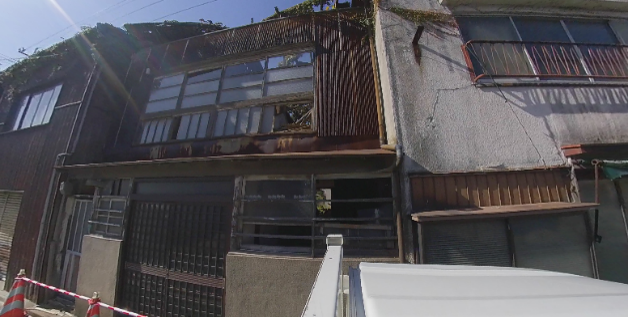
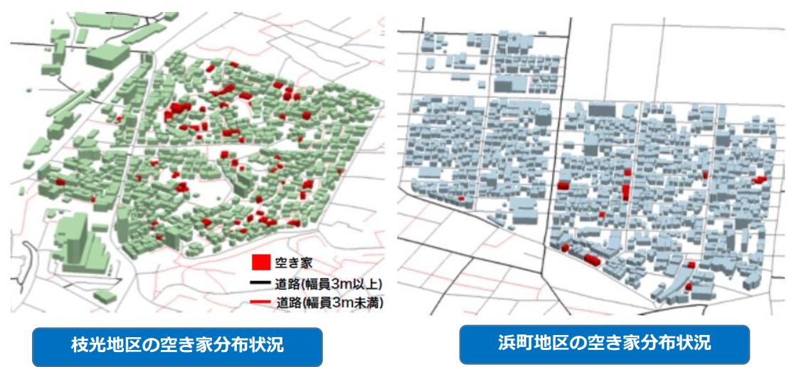
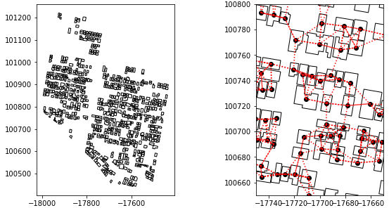

# 2022/06/17 10:00 ~ 打ち合わせ

# 研究計画に関して

## 研究テーマ

「持続可能なストック型社会の構築へ向けた都市構造物の退蔵ストックの発生メカニズムの解明と将来予測モデルの開発」

## 目的

- ストック型社会に向けた**退蔵ストックの発生メカニズムの解明**と 、 ストックの退蔵を含めた都市物質代謝の将来予測モデルの構築。
- ストック型社会の観点から、持続可能な都市構造の検討を目指す。

## アプローチ

- 項目１：画像情報及び位置情報による退蔵ストック検出&退蔵ストックGISデータベースの構築
- 項目２：滞留年数や退蔵ストック発生に関するストック間の空間的相互作用のモデル化
- 項目３：ストックの退蔵を含んだ都市物質代謝の将来予測モデルの構築

## 各項目の関係性

# 現地調査に関して

## 実施目的

- 「項目1」へ向けた、建築物 現役/退蔵ストックの外観画像の取得
  - 
    <!-- -  -->
- 「項目2」「項目3」へ向けた、現役/退蔵ストックデータベースの拡充
  - 

## 調査対象地域の選定方法

本研究計画のケーススタディ対象地域は福岡県北九州市。
2020年にて北九州市内の小地域 3 箇所(10 町丁目)をサンプル地区として抽出し，空き家の現地調査を行った．
志賀ら(2013)の研究や国土交通省等の既存文献を参照し，市街地に構造上の課題を抱え，空き家棟数がある程度分析できる数が確保できると考えられることから，市街地形成の背景が異なる 3 つの地域を選定し，その周辺地域を含めて枝光地区，浜町地区，祇園地区の 3 地区をサンプル地区として選定した。

- 2020年の現地調査にて得られた観測データを元に推定された老朽空き家の空間分布
  - 
- 2014年に行政によって実施された北九州市老朽空き家実態調査の結果
  - 
- 推計値と北九州市による実測値の比較
  - 

これらの結果を元に、2022年6月に実施予定の現地調査では、推計値と実測値の乖離が大きい**門司区・若松区**を主な調査対象地域として選定する。(車上カメラによる調査)

加えて、2020年調査にて約70棟の老朽空き家が確認された八幡東区枝光地区も調査対象地域として選定する。(徒歩による調査)

## 調査方法

自動車の屋根上に360度カメラを取り付け、撮影しながら走行する事で、効率的に建築物ストックの外観画像を収集する。
また、自動車の侵入が困難、且つ老朽空き家の存在が予想される地域は、徒歩と360度カメラによる調査を行う。

- 使用機器：
  - Insta360 one x
  - 取り扱い説明書
    - https://s3-ap-northeast-1.amazonaws.com/hacosco-files/dlcenter/insta360/insta360ONEX_manual.pdf
  - https://tips.spacely.co.jp/usinginsta360onex/#sumaho
  - 動画ファイルにGPS衛星から取得を格納する方法。
    - https://www.youtube.com/watch?v=0WAeY729UDo
  - ONE X GPS Smart Remote Tutorial
    - https://www.insta360.com/jp/support/supportcourse?post_id=10894
  - With GPS Smart Remote , you can inject GPS metadata into your video and photo.
    - https://www.youtube.com/watch?v=E41ZNxG_os4

以下のような映像を撮影予定。

- ビデオのスクショ or ビデオ

基本的には「町 丁目」を一つの空間単位として調査を実施する。
「項目2」に関連して、理想的には一つの「町 丁目」内に存在する全ての建築物ストックに対して「現役」「退蔵」のラベル付けを網羅する事が望ましい。

# 「項目1」外観画像 & 位置情報に基づく退蔵ストック検出について

画像認識/物体検出の出力結果に対して、位置情報にもとづく判定結果をどのように結びつけるか

- 方法1:
  - 元々、研究計画の際に想定していた方法
  - 外観情報ベースと位置情報ベースでそれぞれ、退蔵/現役を予測するモデルを構築=>それらの出力値の平均(重み付け)を最終的な出力値に。
  - 
  - 方法2
    - 外観情報ベースで教師ありモデルを構築。＝＞その出力値(外観からの判定結果)を特徴量の一つとして、人口情報・地理的条件, etc.と一緒に教師ありモデルを構築=>最終的な出力値(判定結果)。
    - 
  - 実験して精度が高い方法を選択する? 解釈しやすい方法を選択する?

- 特徴量の一つ
- 旗竿地：
  - ひょろひょろの私道こそ大事。
  - ここの検出ができたら
- 「精度」
